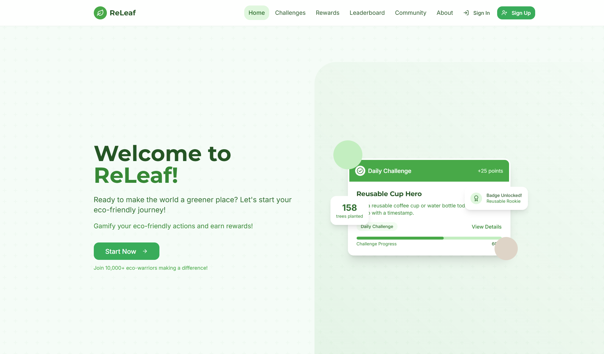
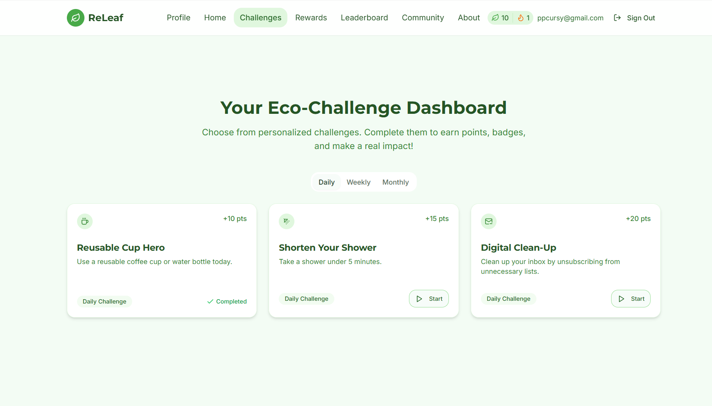
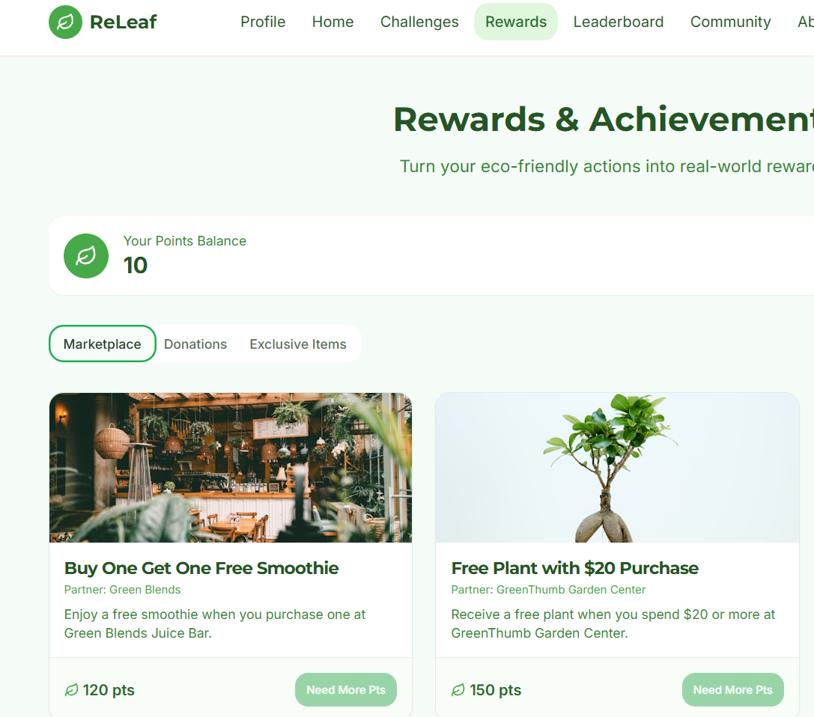
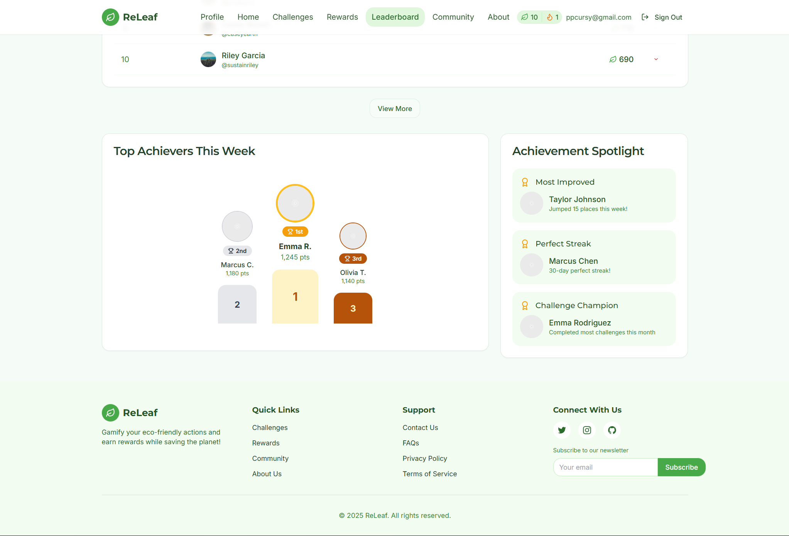
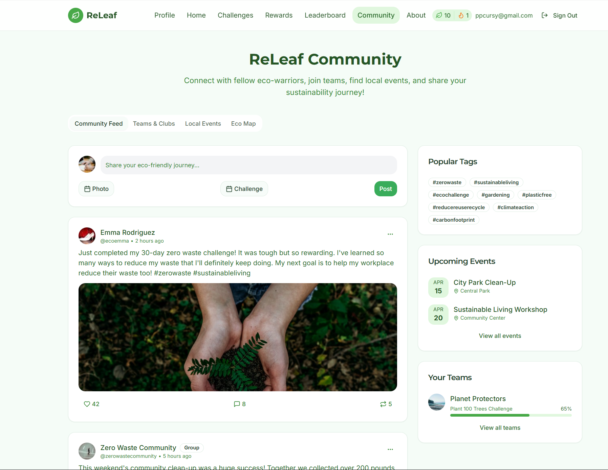
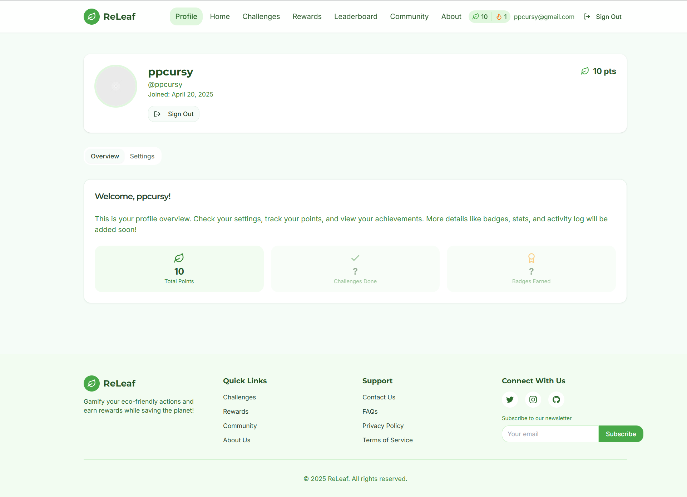
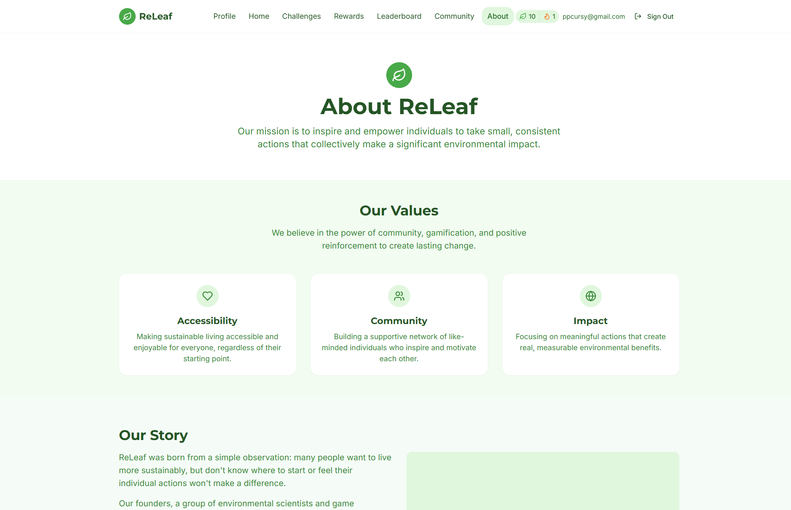

# ReLeaf: Gamified Sustainability

ReLeaf is an innovative app that transforms sustainability into an engaging game. Its main goal is to bridge the gap between environmental awareness and action by making eco-friendly habits fun, social, and rewarding.

[](https://app.netlify.com/projects/theleafy/deploys)

🌐 **[Visit Live Site](https://theleafy.netlify.app)** - Fully deployed and running!
(!NOTE: Please wait 30-50 seconds after loading the live site to get backend up to speed.)

## Key Features

*   **🔐 User Authentication:** Secure JWT-based sign-up, sign-in, and password recovery
*   **🔥 Login Streaks:** Automatic tracking of consecutive daily logins
*   **⭐ Points System:** Earn points by completing eco-friendly challenges
*   **👤 Profile Management:** Customizable user profiles with name, age, and statistics
*   **🎁 Rewards Store:** Redeem points for real-world rewards and donations
*   **🌱 Eco Challenges:** Daily, weekly, and monthly sustainability challenges
*   **📊 Progress Tracking:** Monitor your challenge completion and environmental impact
*   **📱 Responsive Design:** Seamless experience across desktop, tablet, and mobile devices

## Tech Stack

### MERN Stack

*   **MongoDB:** NoSQL database for users, profiles, challenges, and rewards
*   **Express.js:** RESTful API backend with JWT authentication
*   **React:** Modern frontend framework (v18) with Vite build tool
*   **Node.js:** Server runtime environment

### Frontend Technologies

*   **TypeScript:** Type-safe development
*   **React Router (v6):** Client-side routing
*   **Context API:** State management for authentication
*   **Axios:** HTTP client with request/response interceptors
*   **shadcn/ui:** Beautiful UI components built on Radix UI
*   **Tailwind CSS:** Utility-first CSS framework
*   **React Hook Form:** Performant form validation
*   **Zod:** TypeScript-first schema validation
*   **Lucide React:** Modern icon library

### Backend Technologies

*   **Mongoose ODM:** Elegant MongoDB object modeling
*   **JWT:** Secure token-based authentication
*   **bcryptjs:** Password hashing and salting
*   **Express Middleware:** CORS, JSON parsing, error handling
*   **Environment Variables:** Secure configuration management

## Getting Started

### Prerequisites

*   Node.js (v18 or higher recommended)
*   MongoDB (local installation or MongoDB Atlas account)
*   npm or Bun package manager

### Quick Setup

> 🚀 **New to the project?** See [QUICKSTART.md](QUICKSTART.md) for a 5-minute setup guide!

**Detailed documentation:** [MERN_SETUP.md](MERN_SETUP.md)

1.  **Clone and install:**
    ```bash
    git clone https://github.com/mist-ic/ReLeaf.git
    cd ReLeaf
    npm install
    cd server && npm install && cd ..
    ```

2.  **Configure environment:**
    ```bash
    # Backend config
    cd server
    cp .env-example .env
    # Edit server/.env with MongoDB URI and JWT secret
    
    # Frontend config (in root)
    cd ..
    echo "VITE_API_URL=http://localhost:5000/api" > .env
    ```

3.  **Seed database:**
    ```bash
    cd server && npm run seed && cd ..
    ```

4.  **Run the app (2 terminals):**
    ```bash
    # Terminal 1: Backend
    cd server && npm run dev
    
    # Terminal 2: Frontend
    npm run dev
    ```

5.  Open [http://localhost:5173](http://localhost:5173) in your browser

## Screenshots

| Page        | Screenshot                                       |
| :---------- | :----------------------------------------------- |
| Homepage    |             |
| Challenges  |         |
| Rewards     |               |
| Leaderboard |       |
| Community   |           |
| Profile     |               |
| About       |                   |

## Deployment

This application is **currently deployed** and running live at [theleafy.netlify.app](https://theleafy.netlify.app)

### Production Stack
- **Frontend:** Netlify - [theleafy.netlify.app](https://theleafy.netlify.app)
- **Backend API:** Render - Express.js server
- **Database:** MongoDB Atlas - Cloud-hosted database

### Deploy Your Own Instance

**Frontend (Netlify)**
- Connect your GitHub repository
- Build command: `npm run build`
- Publish directory: `dist`
- Environment variable: `VITE_API_URL` = your backend URL

**Backend (Render/Railway/Heroku)**
- Deploy from `server/` directory
- Environment variables: `MONGODB_URI`, `JWT_SECRET`, `NODE_ENV=production`
- Start command: `node server.js`

**Database (MongoDB Atlas)**
- Create free cluster at [mongodb.com/cloud/atlas](https://www.mongodb.com/cloud/atlas)
- Get connection string
- Add to backend `MONGODB_URI`

**Full deployment guide:** [MERN_SETUP.md](MERN_SETUP.md)

## API Documentation

The backend provides RESTful API endpoints:

**Authentication**
- `POST /api/auth/register` - Create new account
- `POST /api/auth/login` - Login user
- `GET /api/auth/me` - Get current user

**Challenges**
- `GET /api/challenges` - List all challenges
- `POST /api/challenges/:id/start` - Start a challenge
- `PUT /api/challenges/:id/complete` - Complete a challenge

**Rewards**
- `GET /api/rewards` - List all rewards
- `POST /api/rewards/:id/redeem` - Redeem a reward

**Profiles**
- `GET /api/profiles/:userId` - Get user profile
- `PUT /api/profiles/:userId` - Update profile

## Live Demo

Visit the live application: **[theleafy.netlify.app](https://theleafy.netlify.app)**

- Create an account
- Complete eco-friendly challenges
- Earn points and redeem rewards
- Track your environmental impact!

## Contributing

Contributions are welcome! Please feel free to submit a Pull Request.

## License

MIT

## Learn More

**MERN Stack Resources:**
- [MongoDB Documentation](https://docs.mongodb.com/)
- [Express.js Documentation](https://expressjs.com/)
- [React Documentation](https://reactjs.org/)
- [Node.js Documentation](https://nodejs.org/)

**Frontend Libraries:**
- [Vite](https://vitejs.dev/)
- [Tailwind CSS](https://tailwindcss.com/docs)
- [shadcn/ui](https://ui.shadcn.com/)
- [React Router](https://reactrouter.com/)
